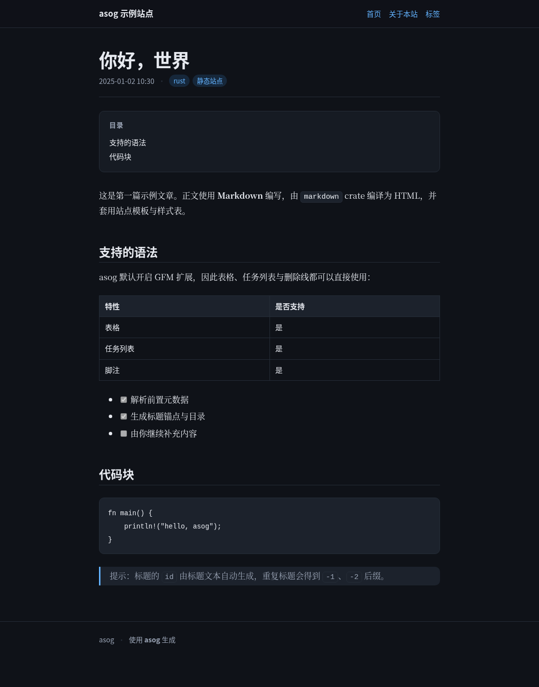

# asog

`asog` 是一个用 Rust 2024 Edition 编写的命令行程序：读取指定文件夹中的
Markdown 文件，把它们编译为完整的静态博客站点并输出到指定文件夹。

## 功能特性

- **命令行参数解析**：基于 [`clap`](https://crates.io/crates/clap) 提供
  `-f/--from` 与 `-o/--output` 两个必需参数，以及站点标题、作者等可选参数。
- **Markdown 编译**：基于 [`markdown`](https://crates.io/crates/markdown) crate，
  默认启用 GFM（表格、任务列表、脚注、删除线），并为标题自动生成锚点 id 与目录。
- **完整站点输出**：除文章页外，还会生成首页（文章列表）、标签页、标签总览页，
  并递归复制图片等静态资源。
- **前置元数据**：支持标题、日期、标签、摘要、草稿、是否列出、目录开关等字段。
- **页眉导航**：`title_bar: true` 的页面会自动出现在页眉导航中，
  用它的标题作为链接文字，无需在正文里手写链接即可访问。
- **站点图标**：源目录中的 `assets/logo.svg` / `assets/logo.png` 等会自动作为网页
  icon（`<link rel="icon">`）；没有该文件时不输出任何 icon 声明。
- **样式表**：内置一份零依赖的现代 CSS（响应式、自动适配深浅色、打印样式），
  源目录中自带 `style.css` 时以其为准。
- **稳健性**：非 UTF-8 文件、坏元数据、危险输出路径等都有明确报错或警告，
  不会中断整站构建。

## 快速开始

```bash
# 构建
cargo build --release

# 把 example/content 编译为静态站点，输出到 example/public
cargo run --release -- -f example/content -o example/public --title "asog 示例站点"

# 打开输出目录中的 index.html 即可浏览（可直接双击，也可用静态服务器）
```

等价的最短形式：

```bash
asog -f ./content -o ./public
```

## 预览

示例站点首页（浅色）与文章页（深色，跟随系统偏好自动切换）：

| 浅色首页 | 深色文章页 |
| --- | --- |
|  |  |

样式设计细节见 [`docs/WEB_DESIGN.md`](docs/WEB_DESIGN.md)。

## 命令行参数

| 参数 | 说明 |
| --- | --- |
| `-f, --from <PATH>` | **必需**。所要获取的 markdown 文件的路径（源目录）。 |
| `-o, --output <PATH>` | **必需**。最终输出静态网页所有文件的路径（输出目录）。 |
| `--title <TITLE>` | 站点标题，默认 `Asog Blog`。 |
| `--description <TEXT>` | 站点描述，用于首页与 `<meta name="description">`。 |
| `--author <NAME>` | 作者名，显示在页脚。 |
| `--lang <LANG>` | 页面语言，写入 `<html lang="...">`，默认 `zh-CN`。 |
| `--clean` | 构建前清空输出目录（拒绝清空根目录或包含当前工作目录的路径）。 |
| `--drafts` | 同时构建 `draft: true` 的草稿。 |
| `--no-raw-html` | 禁止 Markdown 中的原始 HTML（默认允许，便于插入自定义标签）。 |
| `-v, --verbose` | 输出每个文件的详细构建日志，可重复（`-vv`）。 |

## 内容组织

```
content/                     # 源目录（-f）
├── index.md                 # 首页正文（可选）
├── hello-world.md           # 一篇文章 → hello-world.html
├── about.md                 # listed: false + title_bar: true → 只进页眉导航
├── draft-post.md            # draft: true，默认不构建
├── rust/
│   └── ownership.md         # 嵌套目录 → rust/ownership.html
└── assets/
    └── logo.svg             # 静态资源原样复制，并自动作为站点图标
```

约定如下：

1. 递归查找 `.md` / `.markdown` 文件（扩展名不区分大小写），
   输出到相同相对路径并以 `.html` 结尾。
2. 以 `.` 开头的隐藏文件与目录（如 `.git`）会被忽略。
3. 非 Markdown 文件（图片、字体、附件等）原样复制到输出目录。
4. 源目录根部的 `index.md` 作为首页正文；其他位置的 `index.md` 是普通页面。
5. 文章标题的推导顺序：前置元数据 `title` → 正文第一个一级标题（否则二级标题）→ 文件名。
   当标题来自正文标题时，该标题不会在正文中重复出现。
6. 摘要的推导顺序：前置元数据 `summary` → 正文首段（截断至 200 字符）。
7. 首页与标签页中的文章按日期倒序排列；没有日期的文章排在最后，同日期按标题排序。
8. 页面之间的相对链接（样式表、首页、标签页、文章）会根据输出深度自动计算，
   嵌套目录中的页面无需手工处理 `../`。
9. 页眉导航固定为「首页 → 各 `title_bar: true` 的页面 → 标签」，
   其中自定义页面按**源文件路径**排序，因此可以用 `01-about.md` 这类文件名控制先后。
   `title_bar` 与 `listed` 相互独立：常见的组合是
   `listed: false` + `title_bar: true`（只通过页眉访问的固定页面）。
10. 站点图标取源目录中的 `assets/logo.*`（见下节），找不到时页面不输出任何 icon 声明。

## 前置元数据（front matter）

在文件开头使用 `---` 围栏的键值块，支持 YAML 的一个常用子集：

```markdown
---
title: 你好，世界
date: 2025-01-02 10:30
updated: 2025-01-05
tags: [rust, 静态站点]
summary: 一篇文章的摘要
draft: false
listed: true
toc: true
title_bar: false
---

# 正文标题
```

| 字段 | 类型 | 说明 |
| --- | --- | --- |
| `title` | 文本 | 文章标题；缺省时按上述顺序推导。 |
| `date` / `published` / `pubdate` | 日期 | 支持 `YYYY-MM-DD`、`YYYY/MM/DD`、`YYYY-MM-DD HH:MM(:SS)`（可带时区后缀）。 |
| `updated` / `lastmod` | 日期 | 更新时间，渲染为「更新于 …」。 |
| `tags` / `categories` | 列表 | 支持 `[a, b]`、`a, b` 以及缩进块列表；多个字段会合并去重。 |
| `summary` / `description` / `excerpt` | 文本 | 列表中的摘要。 |
| `draft` / `unpublished` | 布尔 | `true` 时默认跳过，`--drafts` 可包含。 |
| `listed` / `visible` / `index` | 布尔 | `false` 时不进入首页与标签页列表，但页面照常生成。 |
| `toc` | 布尔 | `true` 时在文章页生成目录（标题数 ≥ 2 时显示）。 |
| `title_bar` | 布尔 | `true` 时把该页面加入页眉导航（链接文字为页面标题），默认 `false`。 |
| `slug` / `permalink` | 文本 | 覆盖输出文件名，值会经过 slug 化处理。 |

解析器只实现博客场景够用的子集：无法解析的行、未知字段都会记录为警告
（用 `--verbose` 或默认输出可以看到），不会导致构建失败。

## 站点图标

在源目录的 `assets/` 下放置 `logo.svg` 或 `logo.png`，asog 会自动把它作为网页 icon：

```html
<link rel="icon" type="image/svg+xml" href="assets/logo.svg">
```

- **识别顺序**（同时存在多个时取优先级最高的一个）：
  `logo.svg` → `logo.png` → `logo.ico` → `logo.webp` → `logo.avif` → `logo.jpg` → `logo.jpeg` → `logo.gif`。
- **匹配规则**：仅匹配源目录根部 `assets/` 中的 `logo.*`，大小写不敏感
  （`assets/Logo.PNG` 同样有效，输出保留原文件名）；子目录里的同名文件不算。
- **没有该文件时**：不输出任何 `<link rel="icon">`，也不会使用任何内置图标。
- **相对路径**：嵌套目录中的页面会自动写成 `../assets/logo.svg`。
- 图标本身仍作为普通静态资源复制到输出目录，因此链接始终有效。
- `type` 属性根据扩展名生成；未知扩展名时只输出 `href`。

## 输出结构

执行 `asog -f example/content -o example/public --title "asog 示例站点"` 后：

```
public/
├── index.html               # 首页：站点简介 + index.md 正文 + 文章列表 + 标签云
├── style.css                # 内置样式表（源目录自带同名文件时保留源文件）
├── hello-world.html
├── about.html
├── rust/ownership.html      # 嵌套目录保持层级
├── assets/logo.svg          # 源目录中的静态资源原样复制
└── tags/
    ├── index.html           # 标签总览
    ├── rust.html
    └── 静态站点.html         # 标签页（文件名使用 slug，链接自动百分号编码）
```

输出目录位于源目录内部时程序会直接报错，避免自我递归；
`--clean` 清空输出目录前还会检查路径，拒绝清空根目录或包含当前工作目录的路径。

## 项目结构

```
src/
├── main.rs          # 程序入口（返回进程退出码）
├── lib.rs           # 库入口：模块声明与 run_cli()
├── cli.rs           # 命令行参数解析（clap derive）
├── markdown.rs      # Markdown → HTML 编译、标题锚点、目录、标题/摘要推导
├── frontmatter.rs   # 前置元数据解析（键值、列表、日期、布尔）
├── page.rs          # HTML 模板：外壳、文章页、首页、标签页
├── site.rs          # 构建流水线：发现 → 编译 → 渲染 → 复制资源
├── util.rs          # 转义、slug、路径、URL 编码等工具
└── assets/style.css # 内置样式表（通过 include_str! 内嵌）
example/content/     # 示例源目录
tests/site_build.rs  # 端到端与 CLI 集成测试
docs/MAIN.md         # 需求说明
docs/WEB_DESIGN.md   # 网页样式设计说明
```

与 `docs/MAIN.md` 中三个模块的对应关系：

| 需求 | 实现 |
| --- | --- |
| 命令行参数解析（`-f/--from`、`-o/--output`） | `src/cli.rs` |
| markdown 编译器（使用 `markdown` crate） | `src/markdown.rs` |
| 修饰网页的样式表 | `src/assets/style.css`（配合 `src/page.rs` 模板） |

## 开发

```bash
cargo test                                   # 单元测试 + 集成测试
cargo clippy --all-targets -- -D warnings    # 静态检查
cargo fmt                                    # 代码格式化
cargo run -- -f example/content -o example/public -v
```

> **关于 `.cargo/config.toml`**：仓库内附带了一份工作区局部的 Cargo 配置，
> 让依赖索引与缓存写入 `<仓库>/.cargo/`（已在 `.gitignore` 中忽略），
> 这样在只允许写工作目录的沙箱环境中也能正常构建。
> 如果你的环境可以直接使用 `~/.cargo`，可以删除该目录，直接执行
> `cargo build` 即可（`cargo` 会自动回退到用户级配置）。

## 许可证

MIT
